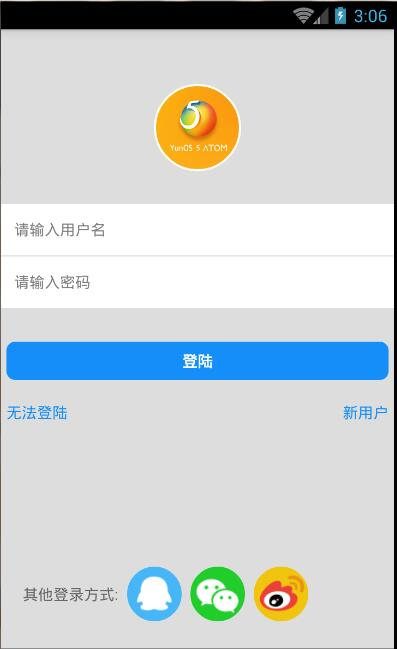

### 这是仿照qq的登陆页面，注意android上面的代码和ios的不同，ios上插件比较多，兼容性比较好，我们主要看安卓的：

####1.TextInput下方的边框问题：
&emsp;&emsp;这里我们用`underlineColorAndroid="transparent"`解决：
```
    {/*账号密码*/}
    <TextInput placeholder={'请输入用户名'} underlineColorAndroid="transparent" style={styles.textInputStyle}/>
    <TextInput placeholder={'请输入密码'} password={true} underlineColorAndroid="transparent" style={styles.textInputStyle}/>
```
####2.屏幕宽度获取和下面方绝对定位问题：
我们引入Dimensions获取屏幕信息：
```
import React, { Component } from 'react';
import { 
  AppRegistry,  //注册
  StyleSheet,   //样式       
  Text,     //文本组件
  View,     //视图组件
  Image,    //图片组件
  Dimensions,  //获取屏幕信息
  TextInput,  
} from 'react-native';
```
绝对定位问题：
```
var {width,height} = Dimensions.get('window'); //es6语法，获取宽度和高度
```

```
  otherLoginStyle : {
    flexDirection:'row',
    alignItems:'center',
    //绝对定位
    position:'absolute',
    top:height-100,
    left:20,
  }
```
